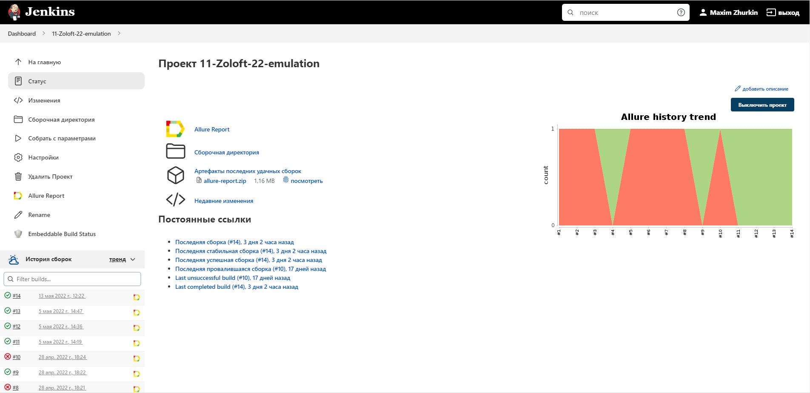
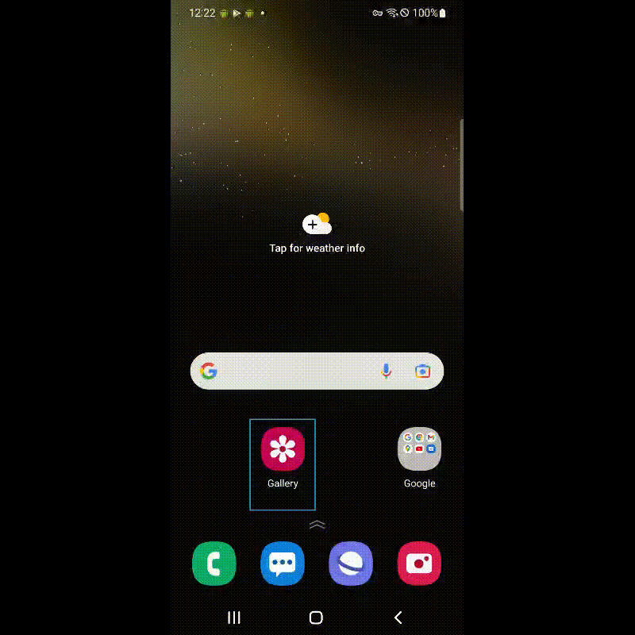

# Проект по автоматизации UI тестирования мобильного приложения Wikipedia
<a href="https://github.com/wikimedia/apps-android-wikipedia/releases/tag/latest"></a>

## :point_up: Структура:

- <a href="#point_up_2-технологии-и-инструменты">Стек</a>
- <a href="#point_up_2-проведенные автотесты">Проведенные автотесты</a>
- <a href="#point_up_2-сборка-в-Jenkins">Сборка в Jenkins</a>
- <a href="#point_up_2-сборка-в-Jenkins">Особенности сборки в Jenkins</a>
- <a href="#point_up_2-запуск-из-терминала">Запуск из терминала</a>
- <a href="#point_up_2-allure-отчет">Allure отчет</a>
- <a href="#point_up_2-видео-примеры-прохождения-тестов">Видео примеры прохождения тестов</a>

## :point_up_2: Стек
<p align="center">


</p>

## :point_up_2: Проведенные автотесты
- Проверка стартовых экранов и поиска в приложении

## :point_up_2: Сборка в Jenkins
### <a target="_blank" href="https://jenkins.autotests.cloud/job/11-Zoloft-22-emulation/">Сборка в Jenkins</a>
<p align="center">

</p>

### Особенности сборки в Jenkins:

- сборку можно запустить как через сервис Browserstack так и через Appium и с помощью реального подключенгного телефона.

## :point_up_2: Запуск из терминала

```
gradle clean test DdeviceHost=browserstack / emulation / real 
```

## :point_up_2: Allure отчет
- ### Главный экран отчета
<p align="center">

</p>

- ### Страница с проведенным тестом
<p align="center">

</p>

## :point_up_2: Видео примеры прохождения тестов
> К каждому тесту в отчете прилагается видео. Одно из таких видео представлено ниже.
<p align="center">
  
</p>